<picture>
  <source media="(prefers-color-scheme: dark)" srcset="./dark(1).svg">
  <source media="(prefers-color-scheme: light)" srcset="./light(1).svg">
  
</picture>

### Software Developer • Building practical web & AI projects • Open to Work

---

## 👋 About Me

I'm **Sujan Samanta**, a Computer Science & Engineering graduate focused on software development, web applications, and AI-assisted problem solving.

- 💻 **Software Developer**
- 🧠 Building practical projects while expanding my engineering skills
- 🚀 Currently **Building · Learning · Looking for opportunities**
- 🎓 B.Tech in Computer Science & Engineering — MAKAUT
- 📍 Paschim Medinipur, West Bengal, India

---

## 🛠️ Tech Stack

### Core Skills

| Area | Technologies |
|---|---|
| Languages | Java · JavaScript · SQL · Python |
| Frontend | HTML · CSS · JavaScript · React |
| Backend | Flask |
| Database | MySQL |
| Tools | Git · GitHub · VS Code · Google Colab |
| Computer Science | OOP · DBMS · Operating Systems · Software Engineering · SDLC |

---

## 🚀 Featured Projects

### 📰 Fake News Detection System

AI-assisted web application for verifying news through **text, URLs, and images**.

**What I worked on**
- Dataset preprocessing, labeling, and CSV data handling
- Multi-source verification using News API and Wikipedia
- Model evaluation and testing
- React frontend + Flask backend integration

**Stack:** `Python` `React` `Flask` `News API` `Wikipedia`

---

### 🤟 Sign Language Conversion & Emotion Detection

Computer-vision project focused on interpreting sign-language gestures and facial expressions.

**What I worked on**
- Video-frame processing
- Gesture and action recognition
- Facial-expression processing
- Pattern-recognition based real-time interpretation

**Stack:** `Python` `OpenCV`

---

### 🌐 Personal Portfolio Website

Responsive personal portfolio website created to showcase projects, technical skills, and contact information.

**Stack:** `HTML` `CSS` `JavaScript`

---

## 📊 GitHub Activity

&nbsp;

  

---

## 🤝 Connect With Me

&nbsp;&nbsp;

&nbsp;&nbsp;

---

### `Build • Learn • Ship`

*Open to software development opportunities and meaningful projects.*

